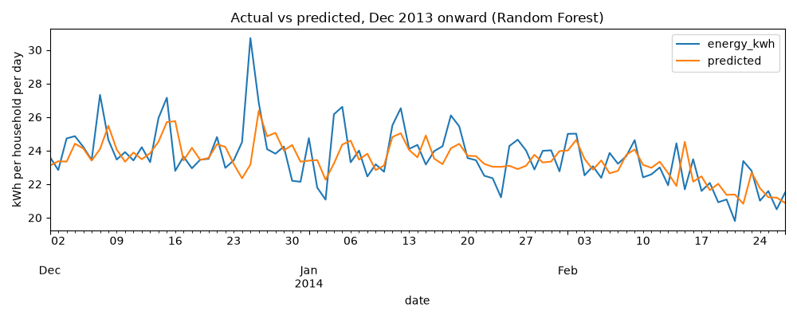

# Smart Energy Monitoring System

An end-to-end data project that cleans household electricity data, stores it in SQLite, detects unusual consumption, forecasts daily usage, and presents everything in an interactive Streamlit dashboard that queries the database with SQL.

Built with Python, Pandas, SQLite, scikit-learn, Plotly and Streamlit.

**Live demo:** https://smart-energy-monitoring-system-exiz4cfleupwmm2r9eu7tq.streamlit.app/

The first load can take a minute, because the app downloads the dataset on its first start (or after it has been asleep). The demo uses historical 2011-2014 data.


## What it does

- **Cleans and prepares** half-hourly smart meter readings (types, duplicates, missing values, time features)
- **Analyses** consumption by hour, weekday, weekend and month
- **Stores** the data in a SQLite database with indexes on household, time and date
- **Detects anomalies** with two methods and compares them: a rolling statistical rule and an Isolation Forest model
- **Forecasts** daily energy use per household, comparing three models and five feature sets (including weather and bank holidays) against simple baselines with walk-forward validation
- **Shows it all** in a multi-page dashboard (Overview, Consumption, Predictions, Anomalies, Reports) with household, date-range, electricity-price and emissions-factor controls. The summary cards and charts are SQL aggregations run against the database, with filters passed as query parameters
- **Estimates carbon emissions** using a configurable factor (default 0.13096 kg CO2e per kWh, see below) and produces a **monthly report** with month-on-month comparison and CSV download


## Data

Low Carbon London smart meter data (Kaggle, "Smart meters in London"), using `block_0.csv`: 50 households, half-hourly energy in kWh.

Source and credit: the readings come from the UK Power Networks-led Low Carbon London project (London Datastore, "SmartMeter Energy Consumption Data in London Households"), which UK Power Networks released under a CC-BY licence. Check the current licence terms on the London Datastore before reuse, and credit the source.

Also used from the same download: daily weather (`weather_daily_darksky.csv`), UK bank holidays (`uk_bank_holidays.csv`) and household tariff labels (`informations_households.csv`). These raw files are not included in this repository.

- Readings run from **December 2011 to February 2014**. This is historical data, not live usage.
- 1,222,670 raw readings; 50 missing values were dropped, leaving 1,222,620. No duplicates or negative values were found.
- Only one household reported before March 2012, and the panel only stabilised (43 to 50 households) from **October 2012**. Trend analysis and forecasting therefore use October 2012 onwards, and the dashboard defaults to that start date.
- Power (kW) is derived from the half-hourly energy: `kW = kWh x 2`.
- Raw data is never modified. Cleaned data is written to `data/processed/` and loaded into `data/energy.db`.

## Key findings


- Consumption is lowest around 03:00 (about 0.5 kW) and peaks at 19:00 (about 1.4 kW). The 18:00 to 21:00 period is roughly 50% above the overall average of 0.90 kW.
- Weekends use about 6% more than weekdays (22.5 vs 21.3 kWh per household per day).
- From October 2012 the data shows a seasonal pattern: about 16 kWh per household per day in summer 2013 and about 24 kWh in winter.


## Anomaly detection

Two methods were run over the same readings and compared.

**1. Rolling rule (`anomaly.py`).** For each household and half-hour slot, "normal" is the mean and standard deviation of the previous 14 readings at that slot. A reading more than 3 standard deviations above normal is flagged. This flagged 38,916 of 1,205,820 checked readings (3.23%).

**2. Isolation Forest (`anomaly_ml.py`).** Features are the reading, the previous reading, the 3-hour rolling average (all scaled by each household's own mean), the hour and the weekday. `contamination` was set to 0.03 to match the rule's flag rate, so the two are comparable. This flagged 36,670 of 1,222,320 readings.

| | ML flagged | ML not flagged |
|---|---|---|
| **Rule flagged** | 10,415 | 28,501 |
| **Rule not flagged** | 26,255 | 1,157,149 |

The methods overlap on about a quarter of flagged readings. Readings flagged by both are treated as higher confidence.

Notes:
- One unusual event shows up as several flagged readings in a row, so counts are of *readings*, not incidents.
- No labelled anomalies exist, so neither method's accuracy can be measured. Flags mean "unusually high for this household at this time", not "fault" or "appliance left on".
- The counts above cover the whole dataset. The dashboard shows lower counts by default because it starts from October 2012.

## Forecasting

Task: predict a household's total energy for the next day (`forecast_v2.py`).

**Features.** Yesterday's usage, usage on the same weekday last week, the average of the last 7 days, the average of the same weekday over the last 4 weeks, day of week, weekend flag, month, a UK bank holiday flag, daily weather (max and min temperature, humidity, wind speed, cloud cover) and a flag for households on the dynamic time-of-use tariff.

**Evaluation: walk-forward validation.** Instead of one test window, models are trained on the past and tested on the following two months, five times (test periods starting April, June, August, October and December 2013). This covers every season in the test data and is a more reliable measure than a single split. Results are MAE in kWh per household per day (lower is better), averaged over the five periods.

| Features | Linear Regression | Random Forest | Gradient Boosting |
|---|---|---|---|
| 1. Original (yesterday, last week, day, weekend, month) | 3.668 | 3.712 | 3.661 |
| 2. + rolling averages | 3.542 | 3.502 | 3.528 |
| 3. + bank holidays | 3.543 | 3.502 | 3.533 |
| 4. + weather | 3.583 | **3.451** | 3.485 |
| 5. + tariff group | 3.583 | 3.451 | 3.485 |

Baselines: "same as yesterday" 3.904, "same day last week" 4.941.

The best model (Random Forest, features 1 to 4) is 11.6% better than "same as yesterday", and 9% to 13% better in every individual test period:

| Test period | Same as yesterday | Random Forest | Improvement |
|---|---|---|---|
| Apr-May 2013 | 3.818 | 3.466 | 9.2% |
| Jun-Jul 2013 | 3.106 | 2.719 | 12.5% |
| Aug-Sep 2013 | 3.276 | 2.871 | 12.4% |
| Oct-Nov 2013 | 4.412 | 3.856 | 12.6% |
| Dec 2013-Feb 2014 | 4.908 | 4.346 | 11.5% |

What helped and what didn't:
- **Rolling averages** gave the biggest gain.
- **Weather** helped the tree-based models modestly (about 1.5% for Random Forest) and made Linear Regression slightly worse. Daily energy is strongly related to temperature (correlation -0.82 with daily maximum temperature), but yesterday's usage already carries much of that information.
- **Bank holidays and the tariff flag** made no measurable difference. Only 25 holiday dates are available, and only 2 of the 50 households were on the dynamic tariff.
- Random Forest and Gradient Boosting are within about 1% of each other, so treat them as roughly tied.
- Winter is the hardest period to predict (highest errors in the last test period).



## Carbon emissions

Estimated emissions = energy (kWh) x an emissions factor. The factor is an input in the dashboard sidebar.

- **Default factor:** 0.13096 kg CO2e per kWh, UK grid electricity (electricity generated, location-based), from the UK Government GHG Conversion Factors for Company Reporting 2026 (DESNZ/DEFRA), methodology paper Table 9.
- **These are estimates, not measurements.** Transmission and distribution losses are not included, and supplier-specific (market-based) factors are not used.
- **Year mismatch:** the readings are from 2011 to 2014, when the UK grid was considerably more carbon-intensive than the 2026 factor implies, so emissions for that period are likely understated.

## Monthly report

The dashboard includes a monthly report (energy, estimated cost, estimated emissions, average per household per day, peak power) for any month from October 2012, for all households or a single one, with a CSV download. It uses full days only (48 readings) and compares months using per-household daily averages, because the number of reporting households varies.

## Project structure

```
data/
  raw/            original download (not tracked)
  processed/      cleaned data and model outputs (not tracked)
  energy.db       SQLite database (not tracked)
dashboard/        Streamlit app: app.py (navigation), common.py (SQL helpers), views/ (one file per page)
models/           forecast results (walk-forward table and latest forecast)
outputs/          charts and screenshots
clean.py  features.py  build_db.py  analysis.py
anomaly.py  anomaly_ml.py  forecast_v2.py
```

## Run it

1. `pip install -r requirements.txt`
2. Download `block_0.csv`, `weather_daily_darksky.csv`, `uk_bank_holidays.csv` and `informations_households.csv` from the Kaggle dataset and put them in `data/raw/`
3. Run in order:
   ```
   python clean.py
   python features.py
   python build_db.py
   python anomaly.py
   python anomaly_ml.py
   python forecast_v2.py
   ```
4. `streamlit run dashboard/app.py`

## Hosting

The dashboard is hosted on Streamlit Community Cloud. The SQLite database (161 MB, 25 MB zipped) is too large for the repository, so it is published as a file on this repo's `data-v1` release and the app downloads it on first start. The two small anomaly CSVs and the forecast result files are committed to the repo. The trained forecast model is not committed (it is large), and the dashboard shows precomputed forecasts. `requirements.txt` pins exact library versions for reproducibility.

## Limitations

- **Dataset age.** Readings are from 2011 to 2014 and do not reflect current usage or tariffs.
- **Small, unrepresentative sample.** 50 households from one file. The average of about 21 kWh per household per day is well above typical UK household use, so results should not be read as UK averages.
- **Changing panel.** The number of reporting households changed over time, so early-period trends are unreliable and excluded.
- **Tariff groups.** Only 2 of the 50 households were on the dynamic time-of-use tariff in 2013, so any price-signal effect on the overall patterns is probably small. The tariff flag did not improve the forecast.
- **Tariff is an assumption.** The default price of 0.25 GBP per kWh is adjustable in the dashboard and is not a real tariff. For reference, non-time-of-use customers in the trial paid a flat 14.228p per kWh (2013).
- **Emissions are estimates.** A 2026 grid factor is applied to 2011-2014 data (see Carbon emissions above), and the factor should be checked against the official publication before reuse.
- **Anomalies are unvalidated.** There is no ground truth, the two detectors disagree on most flags, and a flag does not explain the cause.
- **Forecast scope.** Weather inputs are the observed weather for the forecast day. A real system would have to use a weather forecast, so real-world accuracy would be lower. There are only about 17 months of usable history, and the model still underestimates sudden spikes because it relies on recent usage.
- **Precomputed model outputs.** Anomaly flags and forecasts are produced by the scripts and read by the dashboard. The dashboard does not retrain or score new data.
- **Sampling interval.** Half-hourly data cannot show short bursts of power; the reported peak power is a half-hour average.

## Planned work

- Optional live-data prototype using an ESP32 with a safe, enclosed energy-monitoring module