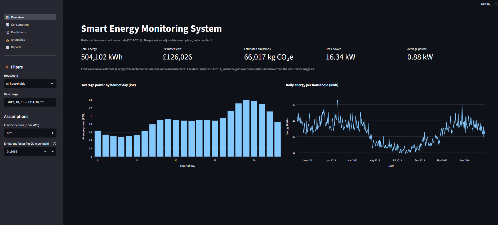
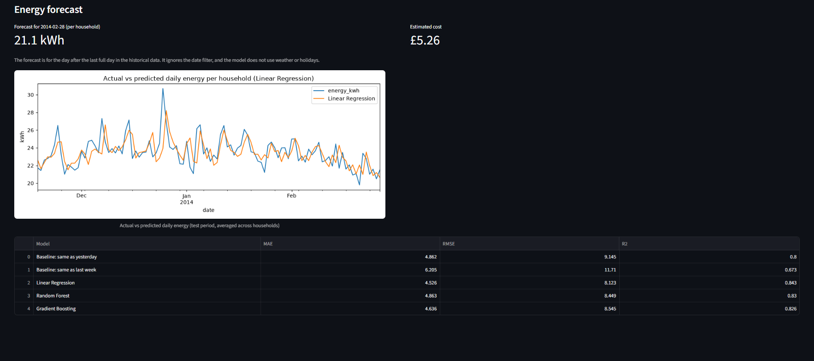
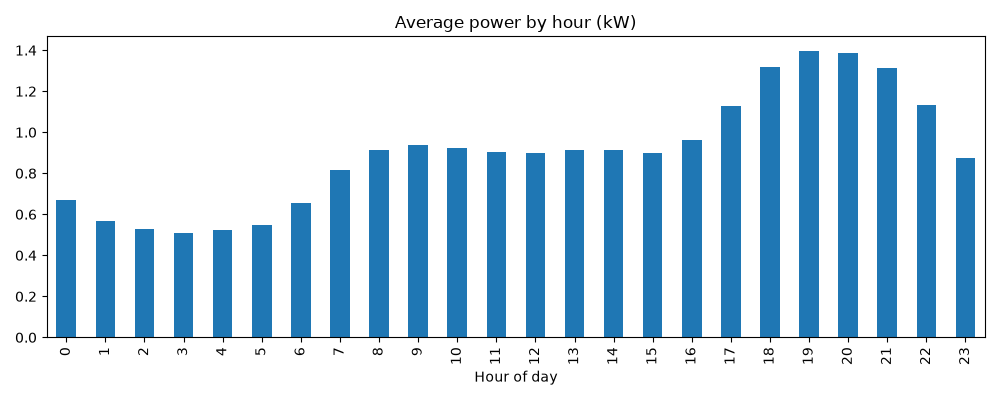
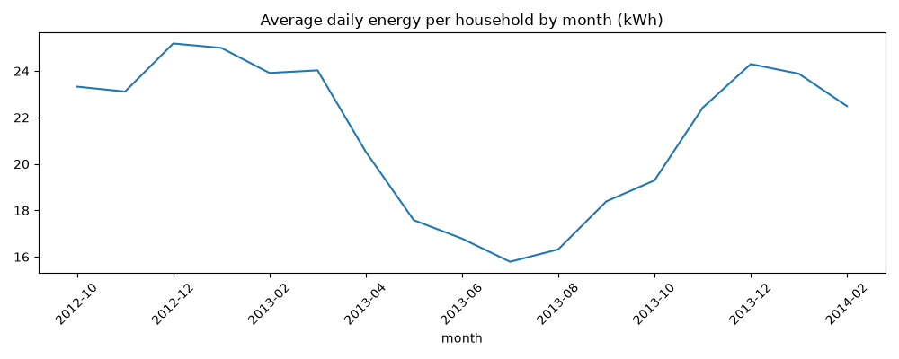
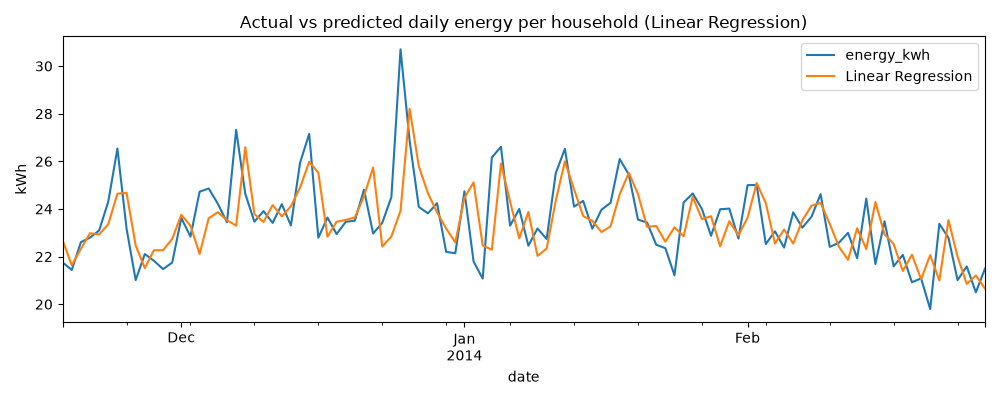

# Smart Energy Monitoring System

An end-to-end data project that cleans household electricity data, stores it in SQLite, detects unusual consumption, forecasts daily usage, and presents everything in an interactive Streamlit dashboard that queries the database with SQL.

Built with Python, Pandas, SQLite, scikit-learn, Plotly and Streamlit.



## What it does

- **Cleans and prepares** half-hourly smart meter readings (types, duplicates, missing values, time features)
- **Analyses** consumption by hour, weekday, weekend and month
- **Stores** the data in a SQLite database with indexes on household, time and date
- **Detects anomalies** with two methods and compares them: a rolling statistical rule and an Isolation Forest model
- **Forecasts** daily energy use per household and compares three models against simple baselines
- **Shows it all** in a dashboard with household, date-range and electricity-price controls. The summary cards and charts are SQL aggregations run against the database, with filters passed as query parameters
- **Estimates carbon emissions** using a configurable factor (default 0.13096 kg CO2e per kWh, see below) and produces a **monthly report** with month-on-month comparison and CSV download



## Data

Low Carbon London smart meter data (Kaggle, "Smart meters in London"), using `block_0.csv`: 50 households, half-hourly energy in kWh.

- Readings run from **December 2011 to February 2014**. This is historical data, not live usage.
- 1,222,670 raw readings; 50 missing values were dropped, leaving 1,222,620. No duplicates or negative values were found.
- Only one household reported before March 2012, and the panel only stabilised (43 to 50 households) from **October 2012**. Trend analysis and forecasting therefore use October 2012 onwards, and the dashboard defaults to that start date.
- Power (kW) is derived from the half-hourly energy: `kW = kWh x 2`.
- Raw data is never modified. Cleaned data is written to `data/processed/` and loaded into `data/energy.db`.

## Key findings



- Consumption is lowest around 03:00 (about 0.5 kW) and peaks at 19:00 (about 1.4 kW). The 18:00 to 21:00 period is roughly 50% above the overall average of 0.90 kW.
- Weekends use about 6% more than weekdays (22.5 vs 21.3 kWh per household per day).
- From October 2012 the data shows a seasonal pattern: about 16 kWh per household per day in summer 2013 and about 24 kWh in winter.



## Anomaly detection

Two methods were run over the same readings and compared.

**1. Rolling rule (`anomaly.py`).** For each household and half-hour slot, "normal" is the mean and standard deviation of the previous 14 readings at that slot. A reading more than 3 standard deviations above normal is flagged. This flagged 38,916 of 1,205,820 checked readings (3.23%).

**2. Isolation Forest (`anomaly_ml.py`).** Features are the reading, the previous reading, the 3-hour rolling average (all scaled by each household's own mean), the hour and the weekday. `contamination` was set to 0.03 to match the rule's flag rate, so the two are comparable. This flagged 36,670 of 1,222,320 readings.

| | ML flagged | ML not flagged |
|---|---|---|
| **Rule flagged** | 10,415 | 28,501 |
| **Rule not flagged** | 26,255 | 1,157,149 |

The methods overlap on about a quarter of flagged readings. Readings flagged by both are treated as higher confidence.

Notes:
- One unusual event shows up as several flagged readings in a row, so counts are of *readings*, not incidents.
- No labelled anomalies exist, so neither method's accuracy can be measured. Flags mean "unusually high for this household at this time", not "fault" or "appliance left on".
- The counts above cover the whole dataset. The dashboard shows lower counts by default because it starts from October 2012.

## Forecasting

Task: predict a household's total energy for the next day. Features: yesterday's usage, usage a week earlier, day of week, weekend flag, month.

Evaluation uses a chronological split (no shuffling):
- Train: 2012-10-08 to 2013-11-17
- Test: 2013-11-18 to 2014-02-27 (mean 23.48 kWh per household per day)

| Model | MAE (kWh) | RMSE (kWh) | R² |
|---|---|---|---|
| Baseline: same as last week | 6.205 | 11.710 | 0.673 |
| Baseline: same as yesterday | 4.862 | 9.145 | 0.800 |
| Random Forest | 4.863 | 8.449 | 0.830 |
| Gradient Boosting | 4.636 | 8.545 | 0.826 |
| **Linear Regression** | **4.526** | **8.123** | **0.843** |

Linear Regression had the lowest MAE, about 19% of the mean daily use and roughly 7% better than "same as yesterday". The differences between the top models are small, and Random Forest only matched the yesterday baseline. Errors are per household per day; the chart below averages across households, which smooths errors out.



## Carbon emissions

Estimated emissions = energy (kWh) x an emissions factor. The factor is an input in the dashboard sidebar.

- **Default factor:** 0.13096 kg CO2e per kWh, UK grid electricity (electricity generated, location-based), from the UK Government GHG Conversion Factors for Company Reporting 2026 (DESNZ/DEFRA), methodology paper Table 9.
- **These are estimates, not measurements.** Transmission and distribution losses are not included, and supplier-specific (market-based) factors are not used.
- **Year mismatch:** the readings are from 2011 to 2014, when the UK grid was considerably more carbon-intensive than the 2026 factor implies, so emissions for that period are likely understated.

## Monthly report

The dashboard includes a monthly report (energy, estimated cost, estimated emissions, average per household per day, peak power) for any month from October 2012, for all households or a single one, with a CSV download. It uses full days only (48 readings) and compares months using per-household daily averages, because the number of reporting households varies.

## Project structure

```
data/
  raw/            original download (not tracked)
  processed/      cleaned data and model outputs (not tracked)
  energy.db       SQLite database (not tracked)
dashboard/app.py  Streamlit app (queries energy.db with SQL)
models/           trained forecast model and results table
outputs/          charts and screenshots
clean.py  features.py  build_db.py  analysis.py
anomaly.py  anomaly_ml.py  forecast.py
```

## Run it

1. `pip install -r requirements.txt`
2. Download `block_0.csv` from the Kaggle dataset and put it in `data/raw/`
3. Run in order:
   ```
   python clean.py
   python features.py
   python build_db.py
   python anomaly.py
   python anomaly_ml.py
   python forecast.py
   ```
4. `streamlit run dashboard/app.py`

## Limitations

- **Dataset age.** Readings are from 2011 to 2014 and do not reflect current usage or tariffs.
- **Small, unrepresentative sample.** 50 households from one file. The average of about 21 kWh per household per day is well above typical UK household use, so results should not be read as UK averages.
- **Changing panel.** The number of reporting households changed over time, so early-period trends are unreliable and excluded.
- **Tariff is an assumption.** The default price of 0.25 GBP per kWh is adjustable in the dashboard and is not a real tariff.
- **Emissions are estimates.** A 2026 grid factor is applied to 2011-2014 data (see Carbon emissions above), and the factor should be checked against the official publication before reuse.
- **Anomalies are unvalidated.** There is no ground truth, the two detectors disagree on most flags, and a flag does not explain the cause.
- **Forecast scope.** The test window covers winter only, the model uses no weather or holiday data, and it underestimates sudden spikes because it relies on recent usage.
- **Precomputed model outputs.** Anomaly flags and the forecast model are produced by the scripts and read by the dashboard. The dashboard does not retrain or score new data.
- **Sampling interval.** Half-hourly data cannot show short bursts of power; the reported peak power is a half-hour average.

## Planned work

- Multi-page dashboard layout
- Optional hosted version of the dashboard
- Optional live-data prototype using an ESP32 with a safe, enclosed energy-monitoring module